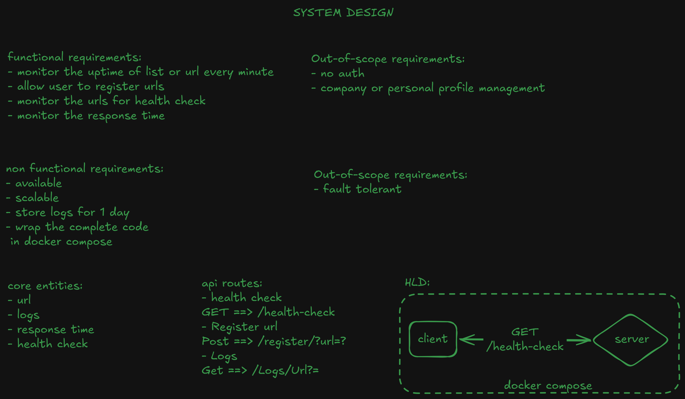
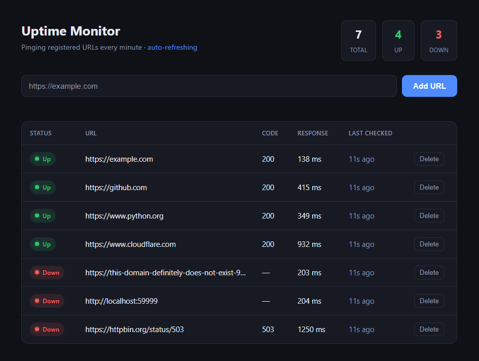

# Uptime Monitor

A lightweight, full-stack uptime monitor. It lets you register a list of URLs,
pings each one every minute, and shows whether each is **up** or **down** along
with its latest HTTP status code and response time — all wrapped in a single
`docker compose up`.

This project was built directly from the system design below. The engineering
decisions made while turning that board into a working MVP — and how they were
shaped in collaboration with AI — are documented in [AI_LOG.md](AI_LOG.md).

---

## System design



The design that drove this build:

**Functional requirements**
- Monitor the uptime of a list of URLs **every minute**
- Allow a user to **register** URLs
- Monitor URLs for a **health check** (up/down)
- Monitor the **response time**

**Non-functional requirements**
- Available
- Store logs for **1 day**
- Wrap the complete code in **Docker Compose**

**Out of scope**
- Scalable
- No auth
- No company / personal profile management
- Fault tolerance (not required for this MVP)

**Core entities:** `url`, `logs`, `response time`, `health check`

---

## Dashboard



The frontend lists every monitored URL with a live up/down badge, HTTP code,
response time, and how long ago it was last checked. It auto-refreshes and
computes the **Total / Up / Down** summary at the top.

---

## Setup (1-line)

Requires Docker with the engine running.

```bash
git clone https://github.com/iAdtya/UpTime-Monitor
```

```bash
docker compose up --build
```

Then open:

- **Dashboard:** http://localhost:8080
- **API docs:** http://localhost:8000/docs

Stop with `Ctrl+C`, then `docker compose down`.

> The frontend calls the backend at `http://localhost:8000`. This works because
> the `fetch` runs in **your browser on the host**, and the backend's port 8000
> is published to the host — no container-to-container networking needed.


<!-- ## Architecture

```
                 docker compose
 ┌───────────────────────────────────────────────────┐
 │                                                     │
 │   frontend (static HTML/CSS/JS)   backend (FastAPI) │
 │   http://localhost:8080  ──────►  http://localhost:8000
 │        polls GET /urls            │                 │
 │                                   │  scheduler loop  │
 │                                   │  every 60s       │
 │                                   ▼                  │
 │                          pings each registered URL   │
 │                                   │                  │
 │                                   ▼                  │
 │                          file logs  (./backend/logs) │
 │                          url list   (./backend/data) │
 └───────────────────────────────────────────────────┘
``` -->

<!-- > **Note on the HLD:** the original board sketched `client ◄─ GET /health-check ─► server`.
> During the build we clarified that the heart of the system isn't the client
> polling the server — it's the **server (an in-process scheduler) polling the
> registered target URLs every minute** and recording the results. The diagram
> above reflects that corrected flow. -->


<!-- ## Project structure

```
.
├── backend/
│   ├── main.py            # FastAPI app, routes, CORS, + the 60s scheduler loop
│   ├── monitor.py         # async pinging (httpx + asyncio.gather)
│   ├── storage.py         # file-based persistence (no DB)
│   ├── requirements.txt
│   ├── Dockerfile
│   ├── .dockerignore
│   └── data/urls.json     # seeded list of URLs to monitor
├── frontend/
│   ├── index.html
│   ├── style.css
│   └── app.js
├── docker-compose.yml
└── README.md
``` -->

---

## API

| Method | Route              | Purpose                                             |
|--------|--------------------|-----------------------------------------------------|
| GET    | `/health`          | Liveness of the **service itself** (not a target)   |
| GET    | `/urls`            | List registered URLs, each with its latest check    |
| POST   | `/urls`            | Register a URL — body `{ "url": "https://..." }`     |
| DELETE | `/urls/{id}`       | Unregister a URL and delete its logs                |
| GET    | `/urls/{id}/logs`  | Check history for a URL (newest first)              |

Interactive docs (Swagger) are served at `http://localhost:8000/docs`.

A stored check looks like:

```json
{
  "checked_at": "2026-07-17T22:03:14.705321+00:00",
  "status_code": 200,
  "response_time_ms": 189.93,
  "up": true
}
```

## Testing steps (verify up/down tracking)

The repo ships seeded with **7 URLs — 4 healthy, 3 broken** — so up/down
detection is visible the moment you start it.

**1. Start it and open the dashboard.** You should see:

| URL | Expected |
|-----|----------|
| `https://example.com` | ✅ Up · 200 |
| `https://github.com` | ✅ Up · 200 |
| `https://www.python.org` | ✅ Up · 200 |
| `https://www.cloudflare.com` | ✅ Up · 200 |
| `https://this-domain-definitely-does-not-exist-9f8e7d6c.com` | ❌ Down · — (DNS failure) |
| `http://localhost:59999` | ❌ Down · — (connection refused) |
| `https://httpbin.org/status/503` | ❌ Down · 503 (reachable but unhealthy) |

**2. Add a working URL.** In the input box, enter a healthy URL, e.g.:
```
https://developer.mozilla.org
```
It appears as **Up · 200** within a second (a first check runs on register).

**3. Add an intentionally broken URL.** Enter something unreachable, e.g.:
```
http://localhost:59999
```
It appears as **Down · —**. This proves the monitor distinguishes reachable
from unreachable hosts.

**4. Delete a URL.** Click **Delete** on any row — it's removed and its logs are
cleaned up.

**5. Inspect the raw history** (optional):
```bash
curl http://localhost:8000/urls/a1b2c3d4/logs
```
or look at the files under `backend/logs/<id>/<date>.jsonl`.

---

## Deployment sketch (IaC)

*Hypothetical — not deployed. Shows the intended cloud topology, not production
hardening.*

For an MVP this small, the simplest path is a **single small VM running the same
`docker compose` stack** behind a load balancer. As it grows, the natural move is
to split into managed services:

- **Frontend** → static files on **S3 + CloudFront** (CDN).
- **Backend** → container on **ECS Fargate** behind an **Application Load Balancer**
  (this is where "available/scalable" comes in — run multiple tasks; the ALB
  spreads traffic; the pinging loop stays in-process per task or moves to a
  scheduled task).
- **Logs/state** → for real scale, swap the file storage for a managed store
  (e.g. DynamoDB or a small RDS/Postgres) with a TTL for the 1-day retention.

A minimal, illustrative Terraform skeleton for the VM approach:

```hcl
# main.tf — hypothetical single-VM deployment (illustrative only)
provider "aws" {
  region = "ap-south-1"
}

resource "aws_instance" "uptime_monitor" {
  ami           = "ami-xxxxxxxx"   # an Ubuntu image with Docker preinstalled
  instance_type = "t3.micro"       # tiny box is plenty for a few dozen URLs

  user_data = <<-EOF
    #!/bin/bash
    cd /opt && git clone <this-repo> app && cd app
    docker compose up -d --build
  EOF

  tags = { Name = "uptime-monitor-mvp" }
}

resource "aws_security_group_rule" "http" {
  # expose 8080 (dashboard) and 8000 (api) to the load balancer / world
  type        = "ingress"
  from_port   = 8080
  to_port     = 8080
  protocol    = "tcp"
  cidr_blocks = ["0.0.0.0/0"]
  # ... plus a matching rule for 8000, and an ALB in front for HTTPS + scaling
}
```

## AI collaboration log

See [AI_LOG.md](AI_LOG.md) for the AI tools/LLMs used, the prompts that shipped
the core layers, and the course corrections made along the way.
